# Hearing Aid

<https://github.com/AliMehraei/hearingaid> · <https://www.argbyte.com> · by Ali Mehraei (ali.mehraei.dev@gmail.com) · [PolyForm Noncommercial 1.0.0 + education](LICENSE.md): free for non-commercial and educational use

An Android app that turns **any earphones** into a personal hearing aid: wired, USB-C, Bluetooth
(AirPods, Galaxy Buds and others) or Android-compatible hearing aids. It amplifies the sound around
you, shaped to your own hearing by a built-in hearing test, and shows **live captions** for people
amplification cannot help. In 19 languages.

  no ads, no accounts, no tracking; sound never leaves the phone.
**[Download the latest release](https://github.com/AliMehraei/hearingaid/releases/latest)** · [Help guide](docs/HELP.md) · [Changelog](CHANGELOG.md)

<p>
  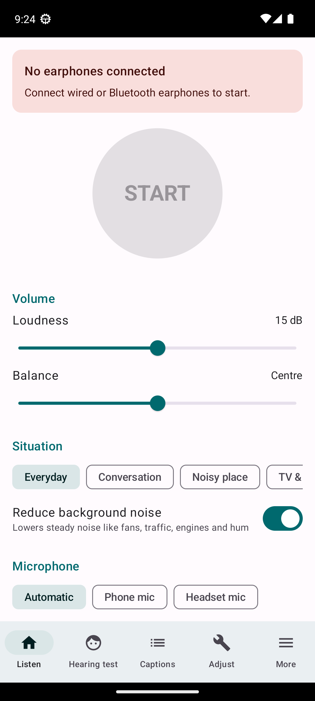
  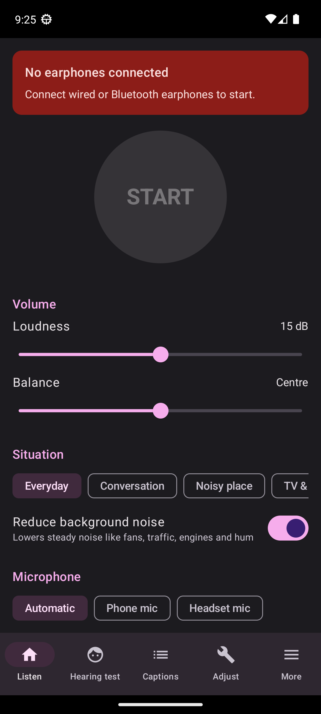
  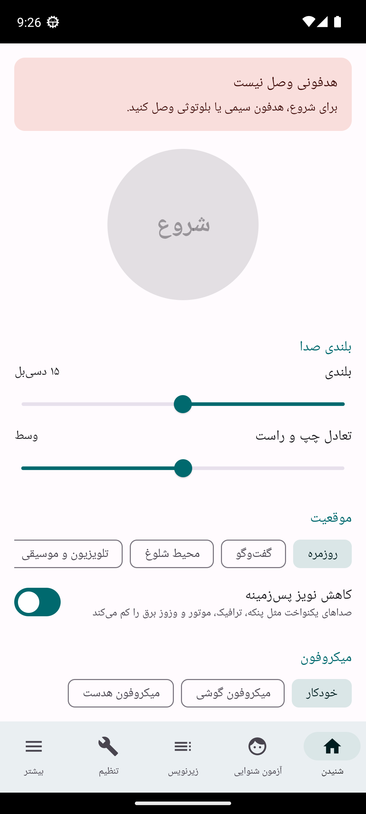
</p>

> **Not a medical device.** Hearing Aid is a personal sound amplifier. It does not replace a hearing
> professional. See [Safety](docs/HELP.md#safety) and the [license](LICENSE.md).

## Screenshots

| | | |
|---|---|---|
| 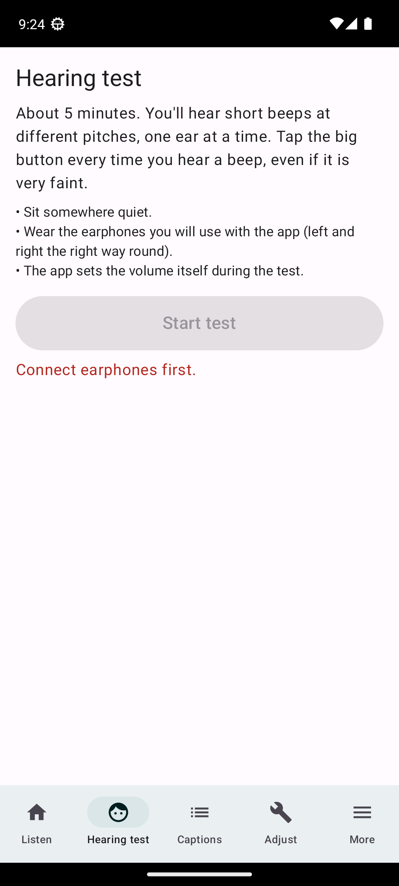 | 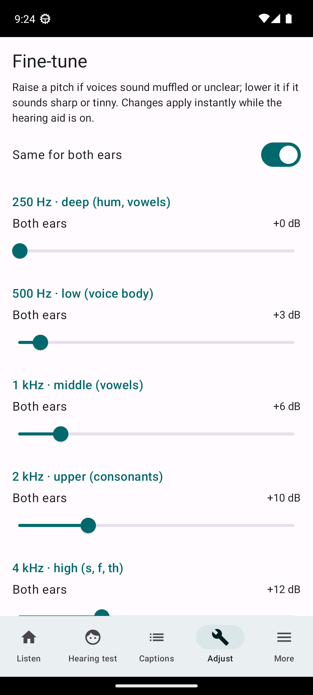 | 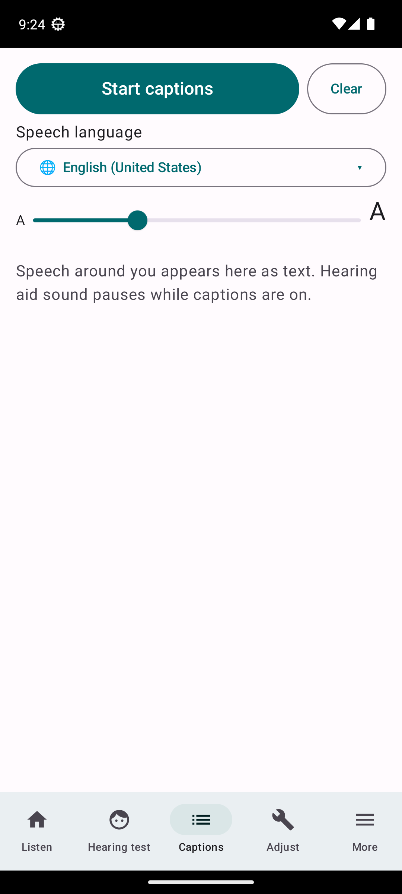 |
| **Hearing test:** beeps per ear and pitch; the result tunes the app | **Adjust:** each pitch for both ears or each ear, comfort and safety limits | **Captions:** speech as large text, in the language people speak |
| 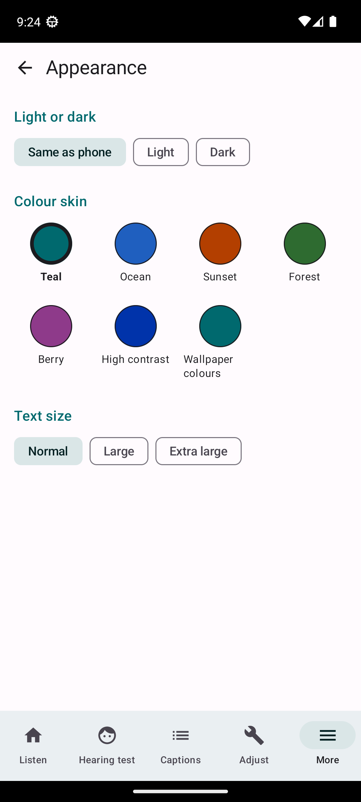 | 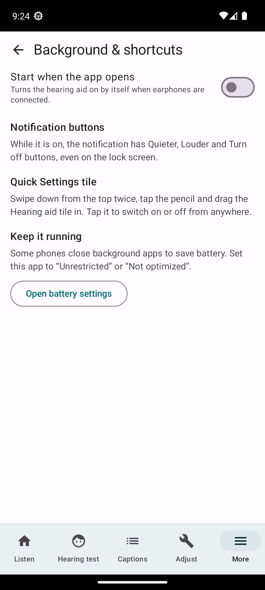 | 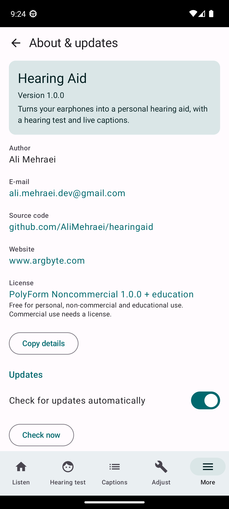 |
| **Appearance:** light or dark, seven colour skins, three text sizes | **Background:** notification buttons, Quick Settings tile, auto-start | **About:** version, author, links, license and updates |

| 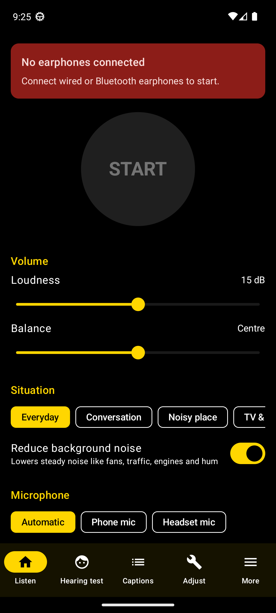 | 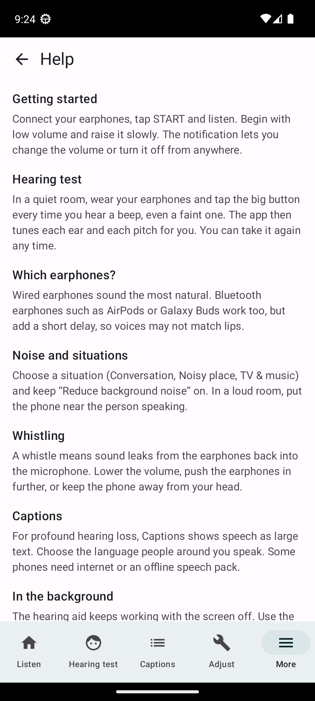 | 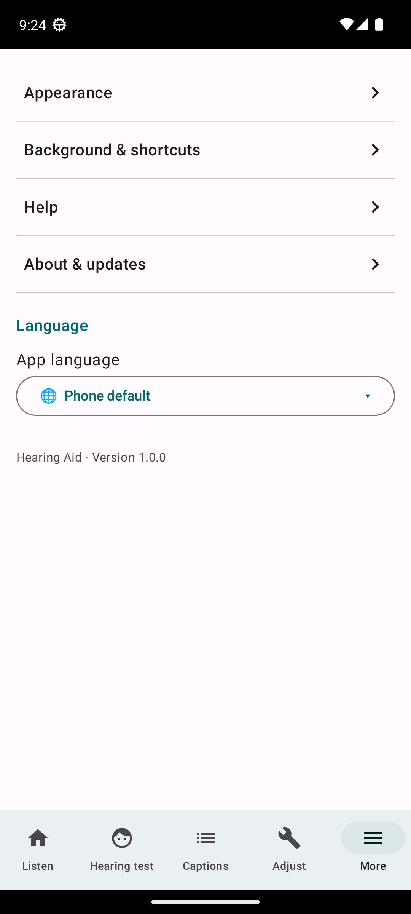 |
|---|---|---|
| **High contrast** skin for low vision | **Help** inside the app | **More:** settings, help, about and language |

Screenshots come from an emulator without earphones, which is why START is greyed out.

## Help

A guide is built into the app: **More › Help**. The complete guide is in [docs/HELP.md](docs/HELP.md).

## Install

1. On your Android phone (Android 8.0 or newer), open the [latest release](https://github.com/AliMehraei/hearingaid/releases/latest)
   and download `hearingaid-<version>.apk`.
2. Open the downloaded file. Android asks once to **allow installs from this source** (your browser or
   file manager); allow it and tap **Install**.
3. Open Hearing Aid, connect your earphones, and take the hearing test.

After that, the app updates itself (see [Updates](#updates)). If you installed an earlier test build
that was not from these releases, uninstall it first: Android only installs updates signed with the same key.

## Features

- **Works with any earphones**: wired is best (no delay); Bluetooth adds about 0.15–0.3 s, and the app tells you.
- **Hearing test** with your own earphones: six pitches per ear, shown as an audiogram, tunes each ear and pitch.
- **Sound shaped for hearing**: separate gain per ear and pitch, loud-sound softening (compression),
  noise reduction for steady noise, and a hard maximum-loudness limit.
- **Situations**: Everyday, Conversation, Noisy place, TV & music.
- **Remote microphone**: put the phone near the person speaking to hear them over room noise.
- **Feedback protection**: if earphones are unplugged, sound pauses at once so the loudspeaker never howls.
- **Captions** for profound hearing loss, in 23 speech languages and variants, with adjustable text size.
- **Background**: keeps running with the screen off; Quieter / Louder / Turn off in the notification;
  a **Quick Settings tile**; optional start when the app opens; a shortcut to battery settings.
- **Skins**: light, dark or same as phone; Teal, Ocean, Sunset, Forest, Berry, High contrast and
  Wallpaper colours (Android 12+); Normal, Large and Extra large text.
- **19 languages** with right-to-left layouts: English, فارسی, العربية, کوردی (سۆرانی), Kurdî (Kurmancî),
  Türkçe, 中文, Deutsch, Русский, Italiano, Français, Español, Português, हिन्दी, اردو, 日本語, 한국어,
  Bahasa Indonesia, Українська. Captions can listen in a different language from the app's.

## How the sound is processed

`app/src/main/java/com/hearingaid/app/dsp/HearingProcessor.kt`, on a high-priority audio thread at the
phone's native sample rate:

1. 80 Hz high-pass (handling noise and rumble).
2. Weighted overlap-add FFT filter bank: 256 points at 48 kHz, sqrt-Hann windows, 75 % overlap,
   about 5 ms of delay, exact reconstruction when gains are flat.
3. Level in six bands (250 Hz–8 kHz, the hearing-test pitches), with 5 ms attack and 80 ms release.
4. Gain per ear and band from the prescription (half-gain rule on the audiogram's shape with a NAL-R
   style low-frequency cut), compressed above the knee (wide dynamic range compression).
5. Gains interpolated across FFT bins on a log-frequency scale.
6. Spectral noise reduction: minimum-statistics noise floor over ~1.5 s and a Wiener-style gain with a floor.
7. Both ears from one inverse FFT (left in the real part, right in the imaginary part), then a peak
   limiter per ear at the chosen maximum loudness.

Unit tests (`app/src/test`) check reconstruction, band selectivity, compression, the limiter, noise
reduction, the prescription and version handling.

## About

**More › About & updates** shows the author, e-mail, version, source code, website and license, and
**Copy details** copies the version, Android version and phone model for bug reports. Its text comes
from `app/src/main/java/com/hearingaid/app/AppInfo.kt`.

### Updates

The GitHub build checks this repository's releases shortly after it opens (at most every 12 hours) and
shows a banner at the top of Listen when a newer release is out. **Later** hides it until the next
version, and *Check for updates automatically* in About turns it off. About also checks on demand.
**Install** downloads `hearingaid-<version>.apk`, checks it against the release's `SHA256SUMS.txt`, and
hands it to Android's installer; Android then also checks that it is signed with the same key.
Settings and the hearing test are kept. The code is in `app/src/main/java/com/hearingaid/app/update/`.

A release must therefore ship `hearingaid-<version>.apk` and `SHA256SUMS.txt`, with a tag like `v1.2.0`.

## Building

Requirements: JDK 17 and the Android SDK (platform 34). The Gradle wrapper downloads the rest.

```powershell
.\gradlew testGithubDebugUnitTest       # unit tests
.\gradlew assembleGithubDebug           # debug APK in app\build\outputs\apk\github\debug\
pwsh .\build-release.ps1                # signed release files in dist\
```

There are two flavors:

| Flavor | For | Updates |
|---|---|---|
| `github` | GitHub releases | updates itself from this repository (needs `INTERNET` and `REQUEST_INSTALL_PACKAGES`) |
| `play` | Google Play | Play delivers updates; no network or install permission |

**Signing.** Release builds read `keystore.properties` in the project root, which is git-ignored and
points at a key outside the repository:

```properties
storeFile=C:/Users/<you>/.hearingaid/hearingaid-release.jks
storePassword=...
keyAlias=hearingaid
keyPassword=...
```

Every update must be signed with this same key, so keep a backup of the `.jks` file and its password.

**Releasing.** Raise `versionCode` and `versionName` in `app/build.gradle.kts`, add the changes to
`CHANGELOG.md`, run `pwsh .\build-release.ps1`, then:

```powershell
gh release create v<version> dist\hearingaid-<version>.apk dist\SHA256SUMS.txt --title "Hearing Aid <version>" --notes-file notes.md
```

Publishing on Google Play is described in [docs/publish-on-google-play.html](docs/publish-on-google-play.html).

## Project layout

```
app/src/main/java/com/hearingaid/app/
  audio/      AudioEngine (mic → DSP → earphones), HearingService, Quick Settings tile, hearing test
  dsp/        FFT filter bank, compression, noise reduction, limiter
  model/      settings, presets, skins, prescription
  captions/   live speech-to-text
  update/     GitHub release check, download, SHA-256 check, install
  ui/         Compose screens
app/src/main/res/values*/   strings for the 19 languages
app/src/github/             GitHub-only manifest (update permissions)
docs/                       help guide, screenshots, Google Play guide
```

## Privacy

Sound is processed on the phone and is never recorded, stored or sent. Settings and the hearing test
stay on the phone. Captions use the phone's speech-recognition service. The GitHub build contacts
GitHub only to check for and download updates. No ads, no analytics, no accounts.

## License

Copyright (c) 2026 Ali Mehraei.

Hearing Aid is **source-available, not open source for commercial use**. It is licensed under the
[PolyForm Noncommercial License 1.0.0](LICENSE.md), with an additional permission for education worldwide:

| | |
|---|---|
| Personal use, study, hobby projects, testing | allowed |
| Schools, colleges, universities and educational institutes, anywhere in the world, public or private, for teaching, learning and research | allowed |
| Individuals using it for education: learning, teaching, tutoring, courses, workshops, research | allowed |
| Charities, public research organizations and government bodies | allowed |
| Changing it and sharing your changes, for non-commercial use | allowed, keep `LICENSE.md` and its Required Notice |
| Any commercial use, including inside a company or as part of a paid product or service | **needs a commercial license** |

For a commercial license, contact **ali.mehraei.dev@gmail.com**.

The license also states that the app is **not a medical device**, that users must obey the law where
they use it (including privacy and eavesdropping laws), and that **the author is not responsible for
any illegal or improper use**. A Persian translation of that part is included.
